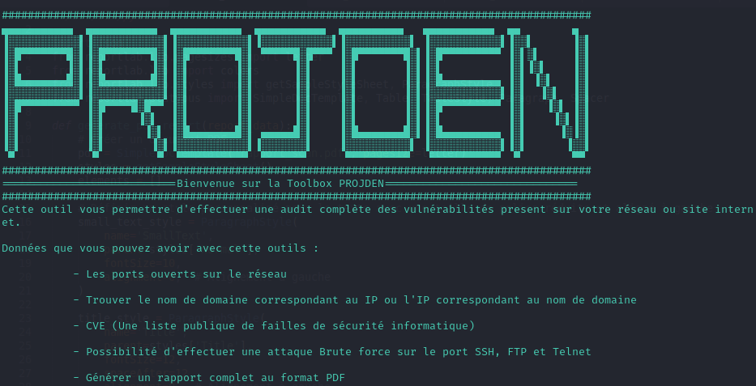
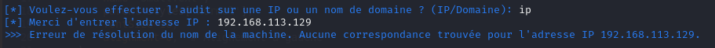
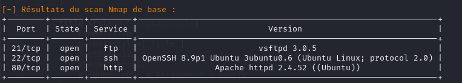
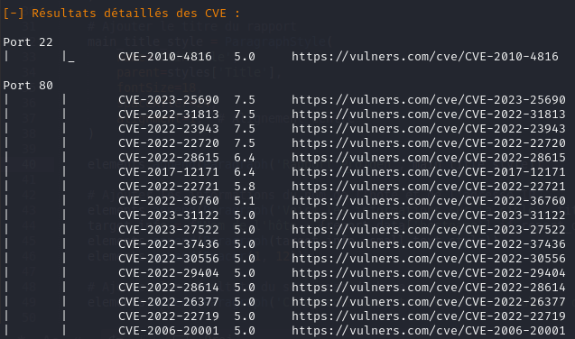
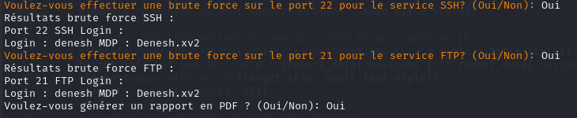
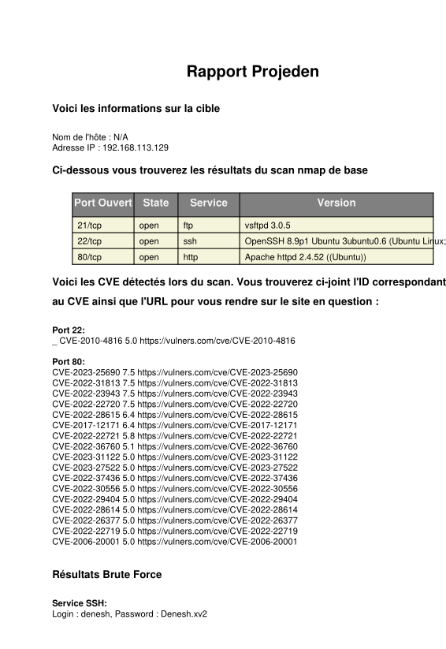

 # Toolbox PROJDEN
 
<p align="center">
  
</p>

## Description du ToolBox

Ce ToolBox est un outil d'audit de sécurité réseau spécialement conçu pour exécuter une série de tâches de reconnaissance et d'analyse de vulnérabilités sur une cible spécifiée, qu'il s'agisse d'une adresse IP ou d'un nom de domaine. Son objectif principal est d'identifier et d'évaluer les faiblesses de sécurité potentielles pour permettre aux administrateurs réseau et aux professionnels de la sécurité de renforcer les défenses de leurs systèmes. Projden représente une solution complète et efficace pour les audits de sécurité réseau, aidant les organisations à identifier et à corriger les vulnérabilités avant qu'elles ne puissent être exploitées par des attaquants malveillants. **Le toolbox doit imperativement être execute sur Kali Linux.**


## Besoin

La réalisation d'audits de sécurité réguliers et la détection proactive des vulnérabilités sont des pratiques indispensables dans le contexte actuel. Les cyberattaques sont en constante augmentation, tant en fréquence qu'en sophistication. Les entreprises et les organisations de toutes tailles sont des cibles potentielles, et une attaque réussie peut entraîner des pertes financières importantes, des interruptions opérationnelles et des atteintes à la réputation. La protection des données sensibles, telles que les informations personnelles des clients, les données financières et les secrets commerciaux, est plus critique que jamais. Une faille de sécurité peut entraîner une fuite de données, exposant ces informations à des tiers non autorisés et potentiellement malveillants.

Une audits de sécurité réguliers et la détection proactive des vulnérabilités sont des pratiques indispensables pour protéger les actifs numériques, assurer la continuité des opérations et maintenir la confiance des parties prenantes dans un environnement numérique de plus en plus hostile.

## Fonctionnalités

- **Résolution de noms de domaine :** Conversion d'un nom de domaine en adresse IP et recherche des serveurs de noms.
- **Résolution d'adresses IP :** Conversion d'une adresse IP en nom d'hôte.
- **Scan de ports avec Nmap :** Identification des ports ouverts et des services associés.
- **Analyse de vulnérabilités :** Utilisation de Nmap avec le script Vulners pour identifier les vulnérabilités sur les 
                                  ports ouverts.
- **Attaque par force brute :** Utilisation d'Hydra pour effectuer des attaques par force brute sur les services SSH, FTP et 
  Telnet.
- **Génération de rapports :** Création de rapports détaillés en PDF résumant les résultats de l'audit.

La Toolbox PROJDEN offre une suite complète de fonctionnalités permettant d'identifier les ports ouverts et les services associés, de résoudre les noms de domaine en adresses IP, de détecter les vulnérabilités à l'aide du script Vulners, d'exécuter des attaques par force brute sur les services SSH et FTP, et de compiler ces résultats dans un rapport PDF détaillé.

## Prérequis

**Voici les prérequis pour ce projet :**

Ce projet est conçu pour être utilisé sur un système d'exploitation Kali Linux, une distribution spécialement dédiée à la sécurité et aux tests d'intrusion.

Python 3.x : Assurez-vous d'avoir Python 3.x installé sur votre système pour exécuter le script.

Modules Python : Les modules suivants doivent être installés pour garantir le bon fonctionnement du projet :
- nmap
- socket
- subprocess
- re
- prettytable
- reportlab
- pexpect
- json
- dns (dns.resolver)

Ces modules fournissent les fonctionnalités nécessaires pour effectuer des scans de ports, analyser les résultats, générer des rapports, et bien plus encore. Vous pouvez installer ces modules via pip avec la commande suivante :

**Pour installer les modules requis, vous pouvez utiliser la commande suivante:**
```sh
pip install python-nmap prettytable reportlab pexpect dns
```

Le choix d'outils spécialisés pour le pentest est essentiel pour garantir la précision, l'efficacité et la profondeur de l'évaluation de la sécurité. Utiliser des outils comme Nmap, Hydra, et les bibliothèques Python telles que dns.resolver et PrettyTable permet d'automatiser et de standardiser les processus de reconnaissance, d'analyse de vulnérabilités et de tests d'intrusion. Nmap est réputé pour sa capacité à effectuer des scans réseau détaillés et à identifier les ports ouverts, les services et leurs versions, ce qui est crucial pour cartographier la surface d'attaque potentielle. Hydra, en tant qu'outil de force brute, est indispensable pour tester la robustesse des mécanismes d'authentification. Les bibliothèques Python, quant à elles, facilitent le traitement et la présentation des données, permettant de générer des rapports clairs et structurés. En somme, ces outils spécialisés fournissent une combinaison de robustesse, flexibilité et efficacité, rendant les audits de sécurité plus complets et fiables.

## Instructions
- **Type d'audit :** Vous serez invité à choisir entre un audit sur une adresse IP ou un nom de domaine.
  <p align="center">
  
</p>

- **Entrée cible :** Entrez l'adresse IP ou le nom de domaine cible.
   <p align="center">
  
</p>

- **Résultats du scan :** Les résultats du scan de ports et de l'analyse de vulnérabilités seront affichés.
   <p align="center">
  
</p>
 <p align="center">
  
</p>

- **Attaque par force brute :** Vous pouvez choisir de lancer des attaques par force brute sur les services détectés.
   <p align="center">
  
</p>

- **Génération de rapport :** Vous aurez l'option de générer un rapport en PDF des résultats de l'audit.
   <p align="center">
  
</p>


## Scripts et Fonctions

- **resolve_hostname(hostname):** Résout un nom de domaine en adresse IP et trouve les serveurs de noms.
- **get_hostname(ip_address):** Résout une adresse IP en un nom d'hôte et trouve les serveurs de noms.
- **perform_basic_nmap_scan(target):** Effectue un scan Nmap basique pour identifier les ports ouverts et les services.
- **parse_basic_nmap_results(raw_data):** Analyse les résultats bruts du scan Nmap en données structurées.
- **scan_vulnerabilities(target):** Scanne les vulnérabilités sur les ports ouverts en utilisant le script Vulners.
- **extract_vulners_data(raw_data):** Extrait les données pertinentes de la sortie Nmap Vulners pour l'affichage.
- **format_results_to_table(basic_results, port_cve_mapping):** Formate et affiche les résultats dans une table.
- **run_hydra(target, port, service):** Exécute Hydra pour effectuer une attaque par force brute et capture les résultats.
- **parse_hydra_results(hydra_output):** Analyse la sortie d'Hydra pour extraire les connexions réussies.
- **check_and_bruteforce(basic_results, target):** Vérifie les ports SSH ou FTP ouverts et propose une attaque par force brute.
- **main():** Fonction principale qui orchestre l'exécution du script selon les choix de l'utilisateur.

## Atouts de cet outil d'audit de sécurité réseau
Cette boîte à outils d'audit de sécurité réseau offre plusieurs atouts significatifs pour les professionnels de la sécurité et les administrateurs réseau :

- **Polyvalence :** Capable de gérer à la fois des adresses IP et des noms de domaine, cet outil est adaptable à divers scénarios d'audit, que ce soit pour des serveurs internes ou des services web externes.
- **Automatisation :** Automatisation des tâches courantes d'audit, telles que la résolution de noms de domaine, les scans de ports, et les analyses de vulnérabilités. Cela permet de gagner du temps et d'éviter les 
                      erreurs humaines.
- **Analyses Approfondies :** Utilisation de Nmap pour réaliser des scans de ports détaillés et des analyses de versions de services, offrant une vision claire des services exposés et de leurs potentiels points faibles.
- **Détection de Vulnérabilités :** Intégration avec le script Vulners de Nmap pour identifier les vulnérabilités connues associées aux services détectés, facilitant la priorisation des actions correctives.
- **Attaques par Force Brute :** Capacité à lancer des attaques par force brute sur les services SSH, FTP et Telnet, aidant à identifier les comptes faibles ou mal configurés.
- **Rapports Détaillés :** Génération de rapports en PDF, permettant de documenter les résultats de l'audit de manière professionnelle et de les partager facilement avec les parties prenantes.
- **Interface Utilisateur Interactive :** Interface utilisateur interactive qui guide l'utilisateur à travers le processus d'audit, rendant l'outil accessible même pour ceux ayant une expérience limitée en sécurité 
                                           réseau.
- **Flexibilité et Extensibilité :** Code source ouvert et modulaire permettant aux utilisateurs d'ajouter facilement de nouvelles fonctionnalités ou d'adapter l'outil à des besoins spécifiques.

Ces atouts font de cet outil une solution puissante et complète pour l'audit de sécurité réseau, offrant à la fois efficacité et profondeur d'analyse.


## Génération de Rapports
Si vous choisissez de générer un rapport PDF, les résultats du scan seront sauvegardés dans un fichier report_data.json. Ensuite, un script externe generate_report.py sera exécuté pour créer le rapport PDF.

Voici comment le PDF sera nommée : **rapport_scan.pdf**
Ce script utilise les données sauvegardées dans report_data.json pour générer un rapport PDF structuré avec les résultats de l'audit.


## Téléchargement 
Cette section fournit les instructions pour cloner le dépôt depuis GitHub en utilisant la commande `git clone`.
```sh
  git clone https://github.com/RamaDossDenesh-SDV/Projet-SDV-RamaDoss-Denesh-M1-CB-B.git
```
Pour executer sur le script vous devez d'abord executer le script **python PROJDEN2** et pour voir le rapport **Firefox rapport_scan.pdf**
## Notes
**Sécurité:** L'utilisation de cet outil doit être autorisée par le propriétaire du réseau ou du domaine. Une utilisation non autorisée est illégale.
**Précautions:** Soyez prudent lors de l'exécution des attaques par force brute, car elles peuvent être détectées comme des comportements malveillants par les systèmes de sécurité réseau.


